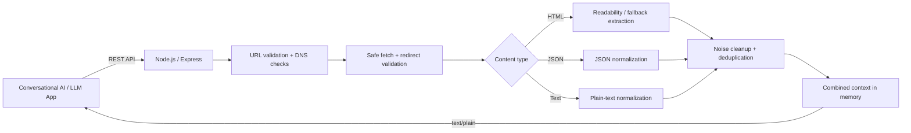

# Web Context for LLM

A small Node.js service that extracts useful text from public web pages and endpoints, normalizes it, and exposes the result as reusable context for Conversational AI, Virtual Agents and LLM applications.

The project is intentionally lightweight: it demonstrates integration architecture, safe URL handling and content extraction without introducing a database, crawler framework or production orchestration layer.

## Problem being solved

AI applications often need fresh context from web content that was not part of the model prompt at design time. Sending raw HTML directly to an LLM is inefficient and can include navigation, scripts, cookie banners, duplicate content and other noise.

This service creates a controlled preprocessing layer:



## Verified capabilities

The current implementation includes:

- HTTP/HTTPS URL validation.
- Rejection of embedded URL credentials.
- DNS resolution before fetching.
- Blocking of localhost, loopback, private IPv4 ranges, link-local addresses, carrier-grade NAT space and private/link-local IPv6 ranges.
- Redirect handling with URL revalidation on every hop.
- Maximum redirect count.
- Fetch timeout using `AbortController`.
- Maximum response-body size while streaming.
- Maximum number of input URLs.
- Maximum combined context size.
- HTML extraction with Mozilla Readability.
- `main` / `article` / `body` fallback extraction.
- URL-fragment / anchor-focused extraction when useful content is found around the requested anchor.
- JSON endpoint support.
- Plain-text endpoint support.
- Removal of scripts, styles, navigation and common consent/cookie UI elements.
- Additional cookie/consent text filtering.
- Exact-block deduplication for longer text blocks.
- API-key protection for all `/api/*` routes.
- In-memory context storage only.

## Technology stack

- Node.js 18+
- JavaScript ES modules
- Express 5
- Native `fetch`
- Mozilla Readability
- JSDOM
- DNS / IP validation with Node.js standard libraries

## Extraction pipeline

For each URL:

1. Parse and validate the URL.
2. Allow only `http:` and `https:` schemes.
3. Reject embedded credentials and localhost names.
4. Resolve DNS and reject the target if any resolved address is private/local.
5. Fetch with manual redirect handling.
6. Re-run URL/DNS validation for each redirect target.
7. Abort requests that exceed the configured timeout.
8. Stop reading when the response exceeds the configured byte limit.
9. Select extraction logic based on content type:
   - HTML → anchor extraction, then Readability, then fallback.
   - JSON → formatted JSON text.
   - Other text → normalized plain text.
10. Clean consent/cookie noise and exact duplicate blocks.
11. Combine successful sources into one context string.
12. Reject the combined context if it exceeds the configured character limit.

Sources are processed sequentially by design. This keeps the prototype easier to observe and avoids creating unnecessary bursts of requests to remote sites.

## URL security / SSRF protection

`src/url-safety.js` is responsible for the first SSRF defense layer. It rejects local/private destinations before a request is made.

The fetcher also uses `redirect: 'manual'`, which is important because automatic redirects could otherwise move a previously validated public URL to a private destination. Each redirect location is passed through the same validation function before the next request.

### Important limitation

The implementation validates DNS and then performs the fetch by hostname. It does **not** pin the fetch socket to the exact IP address that was validated. A hostile DNS service could theoretically change its answer between validation and connection (DNS rebinding / time-of-check-to-time-of-use risk).

For an internet-facing production service, a stronger network isolation strategy should be used, such as an egress proxy, DNS/IP pinning, allowlists or a fetch layer that validates the actual connected address.

## Content normalization

For HTML pages the extractor:

- removes common non-content nodes (`script`, `style`, navigation, headers, footers, iframes, templates, etc.);
- removes selectors commonly associated with cookie/consent interfaces;
- optionally focuses on a requested `#anchor` section;
- uses Mozilla Readability for main-content extraction;
- falls back to `main`, `article` or `body` when Readability does not produce enough usable text;
- preserves useful block boundaries;
- removes obvious cookie-consent text blocks;
- removes exact duplicate long blocks.

This is heuristic normalization rather than semantic crawling, which keeps the service small and easy to explain.

## API endpoints

All `/api/*` endpoints require:

```http
x-api-key: <API_KEY>
```

### `GET /health`

Public health check.

### `GET /api/status`

Returns whether a context is loaded and basic metadata.

### `POST /api/context/test`

Extracts and returns context without changing the active in-memory context.

```json
{
  "urls": [
    "https://example.com/"
  ]
}
```

Example response shape:

```json
{
  "success": true,
  "mode": "test",
  "saved": false,
  "totalUrls": 1,
  "successfulUrls": 1,
  "failedUrls": 0,
  "totalCharacters": 1234,
  "sources": [
    {
      "success": true,
      "url": "https://example.com/",
      "finalUrl": "https://example.com/",
      "status": 200,
      "contentType": "text/html; charset=UTF-8",
      "title": "Example Domain",
      "characters": 250,
      "extractionMethod": "readability"
    }
  ],
  "context": "=== SOURCE 1 ===\n..."
}
```

Values above are illustrative; actual response metadata depends on the remote source.

### `POST /api/context/load`

Runs the same extraction pipeline and stores the combined context in process memory.

### `GET /api/context`

Returns the currently loaded context as `text/plain`. It does not refresh the source URLs.

## Configuration

```bash
cp .env.example .env
npm install
npm start
```

`.env.example` contains:

```text
PORT=3001
API_KEY=replace-with-a-random-local-api-key
FETCH_TIMEOUT_MS=10000
MAX_URLS=20
MAX_RESPONSE_BYTES=3000000
MAX_CONTEXT_CHARS=150000
```

Never commit the real `.env` file.

## How to run

1. Copy `.env.example` to `.env` and choose a local API key.
2. Install dependencies with `npm install`.
3. Start with `npm start`.
4. Open `http://localhost:3001/` for the small browser UI, or use `requests.http` / curl.

Example:

```bash
curl -X POST http://localhost:3001/api/context/test \
  -H "content-type: application/json" \
  -H "x-api-key: YOUR_LOCAL_API_KEY" \
  --data @examples/request.json
```

## Security considerations

This implementation provides a meaningful security baseline rather than production-grade hardening:

- API credentials come only from environment variables.
- No default API key is embedded in source code.
- `.env` is excluded by `.gitignore`.
- API responses use `Cache-Control: no-store`.
- Express identification is disabled and basic response security headers are added.
- Request JSON is limited to 1 MB.
- Remote responses and generated context have separate size limits.
- Remote requests have a timeout and redirect limit.
- Private/local destinations are blocked before fetch and after redirects.
- CORS is not enabled by default; the included UI uses the same origin.

For production, consider stronger authentication, rate limiting, egress-network controls, DNS/IP pinning, observability, caching policy, robots/terms compliance, malware/content scanning and a more formal allowlist policy.

## Limitations

- No JavaScript rendering: content that exists only after client-side execution may not be extracted.
- Readability and fallback extraction are heuristic and may miss unusual layouts.
- No recursive crawling or sitemap traversal.
- No persistence: loaded context disappears when the process restarts.
- Requests are sequential, not optimized for high-throughput crawling.
- DNS rebinding remains a theoretical risk as described above.
- The service does not decide whether a site permits automated retrieval; deployment should respect applicable terms, robots policies and legal requirements.

## Validation

```bash
npm run check
npm test
```

## Possible extensions

- Egress proxy or IP-pinned HTTP client for stronger SSRF isolation.
- Per-domain allowlists and policy rules.
- Content freshness / TTL and caching.
- JavaScript-rendered page support through a sandboxed browser worker.
- Chunking and token-aware context budgets.
- Embedding/vector-store output in addition to plain text.
- Source provenance metadata attached to downstream LLM prompts.
- Queue-based batch extraction and observability.

## License

MIT
